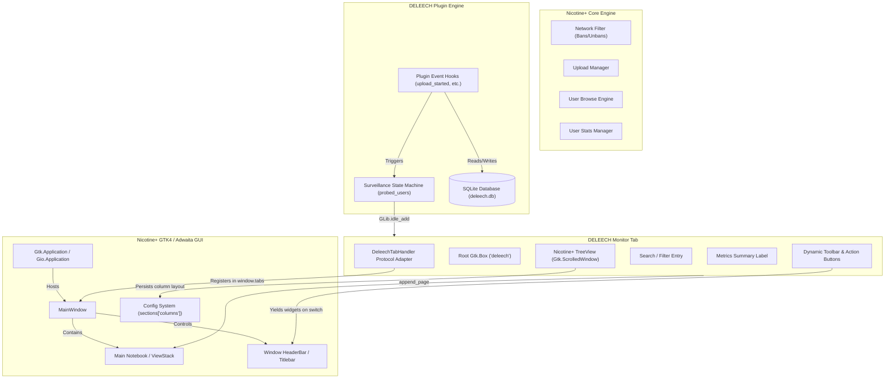
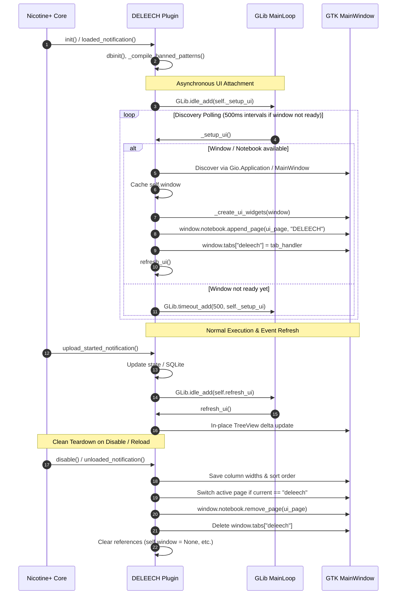
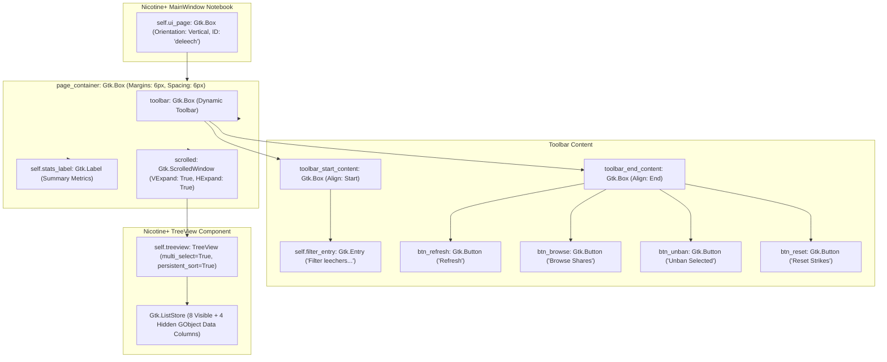
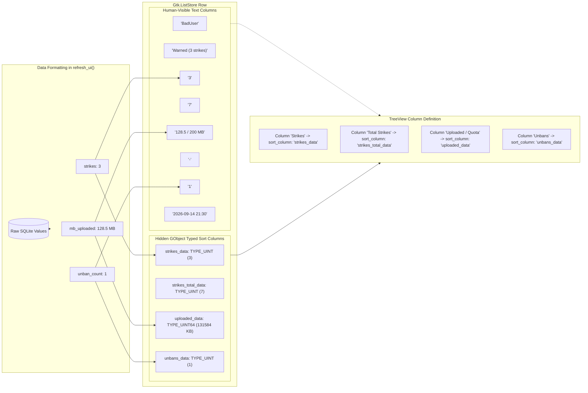
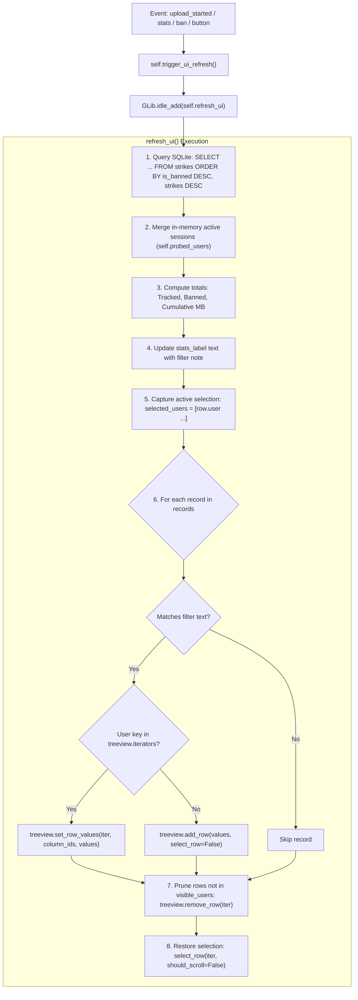
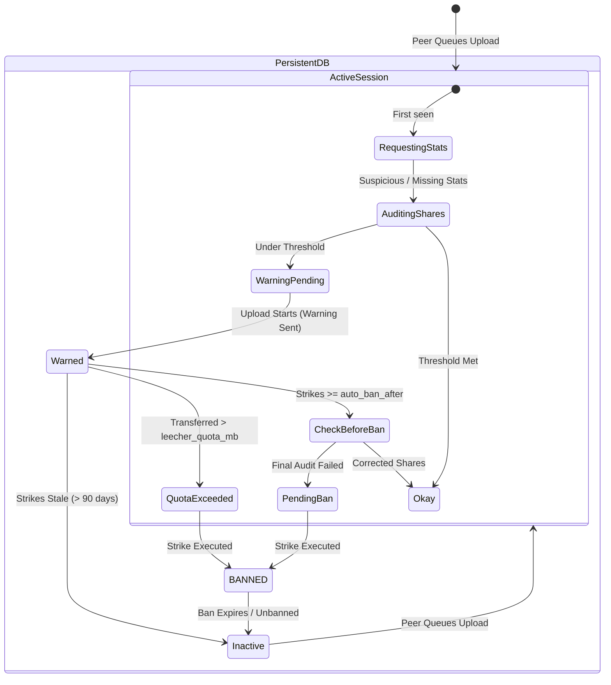
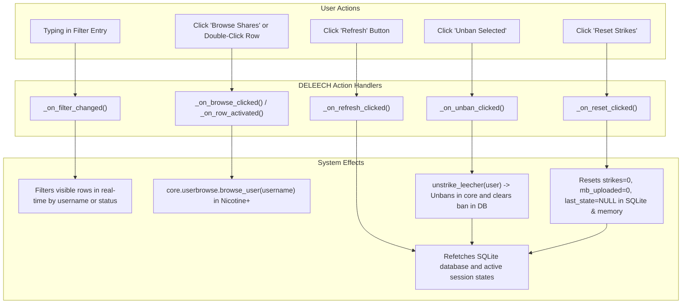

# DELEECH Monitor Window & Nicotine+ GUI Integration

## 1. Overview

The **DELEECH Monitor** is an integrated graphical user interface tab embedded directly into the primary **Nicotine+** desktop application window. It provides real-time visibility into:

- Active and historical leecher surveillance.
- Strike accumulations, quota consumption, and ban timers.
- Live share auditing and state machine progression.
- Direct interactive controls (unbanning, resetting strikes, auditing shares).

By providing transparent inspection and real-time feedback, the monitor eliminates the "black box" behavior of automated anti-leeching.

```
+----------------------------------------------------------------------------------------------------+
|  [Filter: text...   ]                   [Refresh] [Browse Shares] [Unban Selected] [Reset Strikes]  |
|  Tracked Leechers: 42 | Currently Banned: 3 | Cumulative Upload: 1,248.5 MB                        |
+----------------------------------------------------------------------------------------------------+
| Leecher    | Status            | Strikes | Total | Uploaded / Quota | Ban Expiry         | Unbans  |
+------------+-------------------+---------+-------+------------------+--------------------+---------+
| BadUser01  | BANNED            |    3    |   5   | 204.2 / 200 MB   | 2026-09-18 14:22   |    1    |
| SneakyPeer | Auditing Shares   |    1    |   1   |  45.0 / 200 MB   | -                  |    0    |
| HeavyLeech | Warned (2 strikes)|    2    |   2   | 188.0 / 200 MB   | -                  |    0    |
+----------------------------------------------------------------------------------------------------+
```

---

## 2. Nicotine+ Architecture & GUI Integration

Nicotine+ uses **GTK 4** with **libadwaita** (`Adw.ApplicationWindow`, `Adw.ViewStack` / `Gtk.Notebook`). Plugin UIs do not spawn disconnected dialogs; instead, they integrate as first-class tabs alongside native views (*Search*, *Downloads*, *Uploads*, *User Browse*, *Chat Rooms*).

### 2.1 System Architecture



---

## 3. UI Lifecycle & Asynchronous Window Discovery

Nicotine+ loads plugins during early engine initialization, typically before the GTK GUI event loop has created or exposed the `MainWindow`. Spawning GUI widgets synchronously during plugin load would fail or crash.

DELEECH utilizes non-blocking, asynchronous discovery via `GLib.idle_add`:



### 3.1 Window Discovery Hierarchy

To locate the active application window safely across different Nicotine+ versions and GTK packaging environments without locking the UI thread, `_setup_ui()` follows a prioritized hierarchy:

1. **Cached Reference**: Checks `self.window` (fast-path).
2. **Nicotine Application Instance**: Queries `pynicotine.gtkgui.application.Application._instance.window`.
3. **GLib / Gio Application Registry**: Queries `Gio.Application.get_default().get_windows()` for open windows exposing `.notebook`.
4. **Garbage Collection Object Inspection**: As a defensive fallback, inspects `gc.get_objects()` for active `MainWindow` instances.
5. **Debounced Retry**: If the GUI tree is still being assembled, queues a retry in `500ms` via `GLib.timeout_add(500, self._setup_ui)`.

---

## 4. Component Hierarchy & Layout

The UI implements a vertical box layout with integrated spacing and margins matching the standard GNOME Human Interface Guidelines (HIG):



### 4.1 Tab Protocol Adapter (`DeleechTabHandler`)

Nicotine+'s main window switches toolbars dynamically when the user tabs between views. For a plugin tab to receive focus and dock toolbar items into the main window header, it must adhere to the `MainWindow.tabs` protocol:

- **`page` & `content`**: The root `Gtk.Box` page widget.
- **`toolbar`**: The secondary container for standard toolbar mode.
- **`toolbar_start_content`**: Contains the live filter input (`Gtk.Entry`). When header bar mode is active, `MainWindow` elevates this widget into the primary titlebar.
- **`toolbar_end_content`**: Contains the action buttons (*Refresh*, *Browse Shares*, *Unban Selected*, *Reset Strikes*). In header bar mode, this docks into `window.header_end_container`.
- **`toolbar_default_widget`**: Directs default keyboard focus to the search filter entry.
- **`on_focus()`**: Automatically redirects focus to the TreeView for immediate arrow-key navigation.

---

## 5. TreeView & Numeric Sorting Architecture

A common defect in desktop table widgets is **lexicographical string sorting** of numerical and byte data (e.g., `"100 MB"` appearing before `"20 MB"`, or `"9"` appearing after `"10"`).

DELEECH resolves this by using **dual-column mapping** backed by native GObject primitives:



### 5.1 Column Specifications

| Column ID | Visible Header | Type | Width | Sort Column | Description |
| :--- | :--- | :--- | :--- | :--- | :--- |
| `user` | **Leecher** | Text | 150 px | Self (Ascending) | Peer username; acts as unique row iterator key. |
| `status` | **Status** | Text | 140 px | Self | Current enforcement status or state machine badge. |
| `strikes` | **Strikes** | Number | 75 px | `strikes_data` (UINT) | Current warning strikes count (default sort: Descending). |
| `strikes_total`| **Total Strikes** | Number | 95 px | `strikes_total_data` (UINT) | Cumulative lifetime strike count. |
| `uploaded` | **Uploaded / Quota**| Text | 140 px | `uploaded_data` (UINT64) | Bandwidth transferred vs configured leecher limit (in MB). |
| `ban_expiry` | **Ban Expiry** | Text | 160 px | Self | ISO timestamp when ban unlocks (or `-` if not banned). |
| `unbans` | **Unbans** | Number | 75 px | `unbans_data` (UINT) | Number of times the peer has been unbanned. |
| `last_activity`| **Last Activity**| Text | 160 px | Self | Timestamp of most recent strike, scan, or session event. |

### 5.2 Persistence of Sort & Column Preferences

1. **Native Nicotine+ Configuration**: Automatically registers into `config.sections["columns"]["deleech"]`. Column widths, positions, and visibility are persisted natively by Nicotine+.
2. **Plugin Fallback Settings**: When the user clicks a column header, `_on_sort_column_changed()` intercepts the signal and records `sort_column` and `sort_order` directly into `self.settings` to guarantee persistence across plugin reloads.

---

## 6. Real-Time Data Pipeline & Non-Disruptive Refresh

Anti-leech tracking is highly concurrent: upload notifications, stats arrivals, and peer share audits occur continuously in the background.

To keep the UI responsive and prevent list viewport scrolling or selection loss during updates, `refresh_ui()` employs an **in-place delta update algorithm**:



### 6.1 State String Mapping

The monitor translates raw internal workflow states into clear status badges:



| State Machine State | Displayed Badge in Monitor | Condition |
| :--- | :--- | :--- |
| `is_banned == 1` | `BANNED` | User is currently banned in `core.network_filter`. |
| `pending_ban` | `Pending Ban` | Final warning issued; ban will trigger on next transfer start. |
| `check_before_ban` | `Final Audit Before Ban` | User is undergoing last-chance direct peer share audit before ban. |
| `leecher_exceeded_quota` | `Quota Exceeded` | User exceeded maximum allowed bandwidth transfer without sharing. |
| `processed_leecher<nn>` | `Warned (<n> strikes)` | User has received warnings and accumulated strikes. |
| `pending_leecher` | `Warning Pending` | Identified as non-sharing; warning message queued. |
| `requesting_shares` | `Auditing Shares` | Inspecting peer's shared directories directly. |
| `requesting_stats` | `Requesting Stats` | Fetching initial stats from Soulseek server. |
| `okay` | `Okay` | Peer satisfies sharing requirements. |
| DB record (no active state) | `Warned (<n> strikes)` or `Inactive` | Historical record stored in SQLite; not currently transferring. |

---

## 7. Interactive User Controls

The monitor toolbar and row actions give the operator full manual control over the automated enforcement engine:



### 7.1 Action Reference

- **Search Filter Entry**:
  - Live, debounced text search.
  - Matches case-insensitively against both **Username** and **Status** (e.g., typing `banned` displays all currently banned users; typing a username isolates that peer).
- **Refresh**:
  - Manually re-reads `deleech.db` and merges active session states.
- **Browse Shares**:
  - Direct integration with `core.userbrowse.browse_user(user)`.
  - Opens Nicotine+'s native share browser tab for the selected peer.
  - Also triggered by **double-clicking** any row or pressing **Enter**.
- **Unban Selected**:
  - Supports multi-selection.
  - Invokes `self.unstrike_leecher(user)`:
    - Removes peer from Nicotine+'s active ban filter (`core.network_filter.unban_user`).
    - Sets `is_banned = 0`, increments `unban_count`, timestamps `unban_date`, and clears `ban_end_date`.
- **Reset Strikes**:
  - Supports multi-selection.
  - Resets active strike count, uploaded MB, and status flags back to zero in the database while retaining lifetime audit history (`strikes_total`).
  - Sets active state to `"okay"`, giving the peer a clean slate.

---

## 8. Configuration & Toggle Options

The monitor tab can be toggled or configured in the plugin settings (`PLUGININFO` / `self.settings`):

- **`show_ui_tab`** (Boolean, default: `True`):
  - When `True`, the DELEECH tab is created and attached to the main window.
  - When `False`, DELEECH runs as a silent headless background daemon without allocating GTK widgets.
- **`sort_column`** (String, default: `"strikes"`):
  - Preserves the user's selected sort column.
- **`sort_order`** (String, default: `"descending"`):
  - Preserves sort orientation (`"ascending"` or `"descending"`).
- **`leecher_quota_mb`** (Integer, default: `200`):
  - Displayed in the `Uploaded / Quota` column as the maximum threshold before an automatic quota ban triggers.
